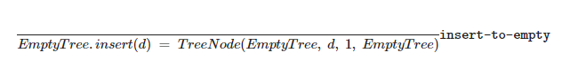
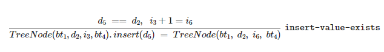
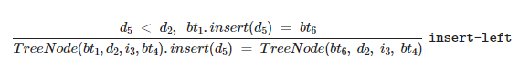
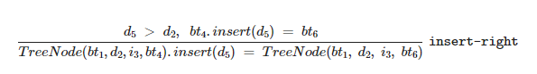
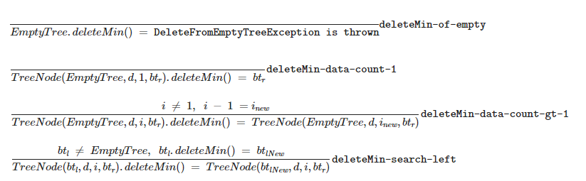

# CSCI 3155 Problem Set 3: Inference Rules

1. This assignment asks you to write scala programs. There are restrictions associated with how you can solve these problems. Please pay careful heed to those. If you are unsure ask your TA or post on piazza.
2. Use the test cases provided to test your solutions. You are encouraged to write your own tests and you are typically given a space to write these tests. **Unless otherwise specified, your personal tests will NOT be graded.**
3. **Very Important:** You are responsible to ensure that your work is submitted correctly. We recommend, after uploading your solution to Canvas, then download the submission and confirm that the correct file was provided for grading.  
4. **Very Important:** Your code will be implemented in **src/main/scala/Main.scala**. Tests are written for you in **src/test/scala/MySuite.scala**. These tests passing, along with adherence to the restrictions outlined for each problem, will determine your grade for the problem set.

## Problem 1: Operations on Binary Search Trees (50 points)  
For this problem we will work on a variant of Binary Search Trees. We will be programming in the functional style in Scala. No pointers. No mutations.

We will use the following variant of a Binary Search Tree. Each node of the tree holds a left-child and right-child as usual. Each node in the tree holds a data value and a count value. So when duplicates are added to the tree, we will increment the count rather than inserting the data to the left-child tree. The tree will be strictly ordered ascending with the smallest data value on the far left and largest data value on the far right.

e.g. Given a tree like: 

~~~
           (2270, 1)
           /        \
  (1300, 2)         X
 /         \
X           X
~~~

If we insert `3155`, we find a new tree:

~~~
           (2270, 1)
           /        \
  (1300, 2)         (3155, 1)
 /         \       /         \
X           X     X           X 
~~~

Now if we insert another `3155` to the tree, we find a new tree


~~~
           (2270, 1)
           /        \
  (1300, 2)         (3155, 2)
 /         \       /         \
X           X     X           X 
~~~

Consider the following example function, in which we want to reject any integer input less than 1 (example syntax for throwing exceptions):   
```
def MyFunction(x: Int): Int = {
    if (x <= 0) {
        throw new IllegalArgumentException("Input must be greater than zero")
    }
}
```

### Problem 1 Part A: Grammar to Object (5 points)
First, some review from week 2.

**Complete a class hierarchy according to the following grammar specification:**

$$\begin{array}{lll}
BinaryTree & \Rightarrow & EmptyTree \\
& | & TreeNode(BinaryTree_1, d, i, BinaryTree_2) \\
\\
&& \texttt{d is a Scala Double} \\
&& \texttt{i is a Scala Int} \\
\end{array}$$


You may name your class attributes whatever you wish, but do know that for $TreeNode(BinaryTree_1, d, i, BinaryTree_2)$:
* $BinaryTree_1$: is the left subtree
* `d`: is the data value being stored
* `i`: is the count of the number of events of the data value being stored.
* $BinaryTree_2$ is the right subtree

### Problem 1 Part B: `insert` (15 points)
* For this problem, it is great to consider how you would solve the problem on your own, however this is intended to be more of an exercise to translate inference rules to code, then it is intended to be an exploration of your own ability to solve the problem in they way that you might want to given a green field.
* Let `bt` be short-hand for `BinaryTree`
* Here is the judgment form: `bt.insert(d) = bt'`
* Here are the relevant inference rules:
<br /><br />

<br /><br />
* `insert-to-empty`: If the tree is empty, then construct a new node of TreeNode(EmptyTree, `<data value>`, 1, EmptyTree)
<br /><br /><br /><br />

<br /><br />
* `insert-value-exists`: If the data value already exists in the tree, then increment the count.
<br /><br /><br /><br />

<br /><br />
* `insert-left`: If the data value is less than an observed value, then insert the new data value in the left sub tree.
<br /><br /><br /><br />

<br /><br />
* `insert-right`: If the data value is greater than an observed value, then insert the new data value in the right sub tree.
<br /><br /><br /><br />
* REMINDER: We are implementing the tree in a functional way. We do not actually edit the original tree. We return a tree that looks like the original tree but with some modification applied.
* ***Restrictions:*** 
    * Must use pattern matching `match` and not the Visitor Pattern
    * can NOT use the keyword `return`

### Problem 1 Part C: `deleteMin` (15 points)
* For this problem, it is great to consider how you would solve the problem on your own, however this is intended to be more of an exercise to translate inference rules to code, then it is intended to be an exploration of your own ability to solve the problem in they way that you might want to given a green field.
* general description
    * If the tree is empty, then throw `DeleteFromEmptyTreeException` with whatever message you want
        * e.g. `throw new DeleteFromEmptyTreeException("cannot delete the minimum value from an empty tree") `
    * Locate the smallest data value in the tree (far left)
        * If the count for this data value is currently 1, then delete the node (replace with the right child)
        * If the count for this data values is currently greater than 1, then decrement the count on that node
* Again, let `bt` be short-hand for `BinaryTree`
* Here is the judgment form: `bt.deleteMin() = bt'`
* Here are the relevant inference rules:
<br /><br />

<br /><br />

* REMINDER: we are implementing the tree in a functional way. We do not actually edit the original tree. We return a tree that looks like the original tree but with some modification applied.
* ***Restrictions:***
    * Must use pattern matching `match` and not the Visitor Pattern
    * can NOT use the keyword `return`

### Problem 1 Part D: `isValidSearchTree` (15 points)
* Finally, let us solve a problem on a binary tree without being provided any inference rules. This will be largely a review of programming with recursion.
* You must solve part A first. You may copy Part A as your starting point to your solution here.
* returns true iff (if-and-only-if)
    * each data value exists only once
    * all counts are greater-than-or-equal to 1
    * the data values exist in strictly ascending order in the tree (left to right)
* else returns false
* ***Restrictions:*** 
    * function `isValidSearchTree` must be a method of `BinaryTree`
    * You may provide parameters with default arguments, or you may use a helper function to solve this problem, but the non-default definition of `isValidSearchTree` must be: `() => Boolean`
    * Must use pattern matching `match` and not the Visitor Pattern
    * Can NOT use the keyword `return`

## Problem 2: Try Catch Maths (50 points)
Now we will work with a variant of the `Maths` language that we discussed in class. We will implement the logic of "try-catch" statements for this problem. We will use this to catch the issue of division by zero.

"try-catch" statements serve a variety of purposes. For an expression `e` of the form `try { e1 } catch { e2 }` we will attempt to execute sub-expression `e1`. If that works without an error, we return the value found. If there's an error, we evaluate sub-expression `e2`.

Consider the below examples in Scala:

```
val denominator = 0
try {
    // is printed
    println("trying things")
    // throws an error, go to catch
    3155 / denominator
    // does not get printed
    println("does this print")
    // is not returned
    true
} catch {
    case _: Throwable => {
        // is printed
        println("an error was thrown")
        // is returned
        false
    }
}
```

```
val denominator = 3155
try {
    // is printed
    println("trying things")
    // is evaluated without error
    3155 / denominator
    // is printed
    println("does this print")
    // is returned
    true
} catch {
    // is never evaluated
    case _: Throwable => {
        // never gets printed
        println("an error was thrown")
        // is NOT returned
        false
    }
}
```

### Problem 2 Part A: Grammar to Abstract Syntax Tree (5 points)
First, a review of week 3 content.

Consider the following grammar

$$\begin{array}{lll}
Maths & \Rightarrow & Value \\
& | & Div(Maths_1, Maths_2) \\
& | & Plus(Maths_1, Maths_2) \\
& | & Times(Maths_1, Maths_2) \\
& | & Minus(Maths_1, Maths_2) \\
\\
Value & \Rightarrow & MathsError \\
& | & NumValue(d) \\
\\ 
MathsError & \Rightarrow & DivByZeroError \\
\\
&& \texttt{d is a Scala Double}
\end{array}$$

Translate the grammar to a class hierarchy.

### Problem 2 Part B: evaluation (45 points)
* We have covered the logic of `Plus`, `Minus`, and `Times` in class already
* `Div`
    * Here, for `Div`, if the value of the denominator is equal to `0`, then we return a `DivByZeroError`
* `TryCatch(m1, m2)`
    * This is like a try-catch in most languages
    * attempt to evaluate `m1`
        * If the value returned is a non-error value `v1`, then return `v1`, do NOT evaluate `m2`
        * else, if the value returned is an error value `DivByZero`, then evaluate `m2` to a value `v2` and return `v2`. It is okay if `v2` is an error value.
* ***Restrictions:*** 
    * Must use pattern matching `match` and not the Visitor Pattern
    * can NOT use the keyword `return`

