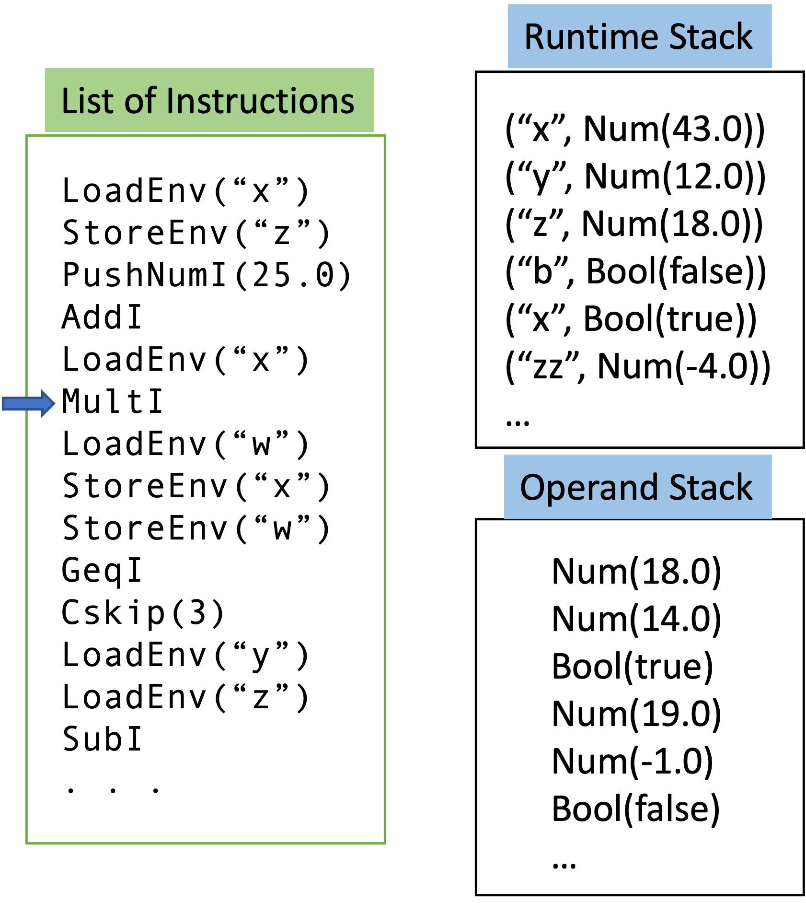
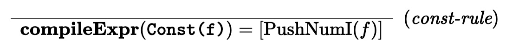
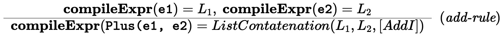
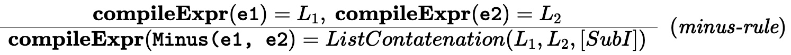
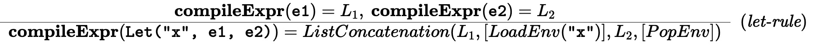
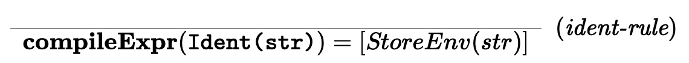
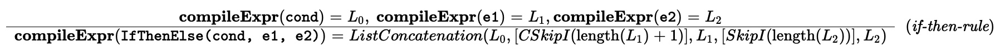

# CSCI 3155 Summer 2024 Project 1 - Compile Arithmetic Expressions with Let Bindings into Stack Machine Bytecode

The objective of this project is to explore (A) compiling arithmetic expressions with let-bindings into a __stack
machine bytecode__ and (B) writing an emulator to execute this bytecode. This is all to be done in standalone scala
using VSCode or some IDE such as IntelliJ that supports `sbt` (Scala Build Tools). You will do this by modifying
the `StackMachineCompiler.scala` and `StackMachineEmulator.scala` files. `TODO` comments in those file mark the places
where your code should go.

We will have covered how to set up VSCode to work with Scala in recitation, but if you run into any issues either installing or running `sbt`, we recommend reading through the `sbt` ["Getting Started Guide"](https://www.scala-sbt.org/1.x/docs/Getting-Started.html).

## Instructions for Testing.

#### Command line: sbt

You can run Main from the command prompt with the current directory as the very top directory of the project,
by running the following commands:

```bash
$ sbt compile
$ sbt test
```

### Running solution tests

Also, we will use a powerful unit testing package called scalatest. The tests themselves are in two files in the
directory
`src/test/scala/edu/colorado/csci3155/project1/`

There are tests in there for both the compiler and emulator implementations.

#### VSCode

Type `test` in the SBT terminal. It will provide all tests that passed and tests that failed.

#### sbt

To run this go to the terminal and from the very top directory run:

```bash
$ sbt test
```

It will say success if all tests run or give you a failure messages.

## Instructions for submission

1. Ensure everything is saved.
2. Run the tests one last time to ensure everything works as expected.
    * You will not be able to submit if your code does not at least compile.
3. Run the `checkAndZipSubmission` sbt task following one of the options below:
    * (*Terminal*) Run `sbt checkAndZipSubmission` in a terminal
    * (*SBT Shell*) Type `checkAndZipSubmission` on the command prompt for SBT shell.
    * If none of the above works, place the following scala files in a zip file called `submission.zip`. Please make
      sure that the zip file has just these scala files and nothing else.
        * Main.scala
        * StackMachineCompiler.scala
        * StackMachineEmulator.scala
        * StackMachineTest.scala
        * CompilerTest.Scala

4. Upload the generated `submission.zip` file.

__Do not__ try to upload your entire directory or all the source files.
If you are having trouble with this, talk to the TA or instructor first.

Failure to submit the right files may incur a penalty.

# The Language

We have encountered arithmetic expressions and let bindings given by the grammar

$$\begin{array}{rcll}
\textbf{Expr} & \rightarrow & Const(\textbf{Double}) \\
& | & BoolConst(\textbf{Boolean})\\
& | & Ident(\textbf{Identifier})\\
& | & Plus( \textbf{Expr}, \textbf{Expr})  \\
& | & Minus( \textbf{Expr}, \textbf{Expr}) \\
& | & Mult(\textbf{Expr}, \textbf{Expr}) \\
& | & Div(\textbf{Expr}, \textbf{Expr}) \\
& | & Log(\textbf{Expr}) \\
& | & Exp(\textbf{Expr}) \\
& | & Sine(\textbf{Expr}) \\
& | & Cosine(\textbf{Expr}) \\
& | & Geq(\textbf{Expr}, \textbf{Expr}) \\
& | & Eq (\textbf{Expr}, \textbf{Expr}) \\
& | & And (\textbf{Expr}, \textbf{Expr}) \\
& | & Or (\textbf{Expr}, \textbf{Expr}) \\
& | & Not(\textbf{Expr}) \\
& | & IfThenElse(\textbf{Expr}, \textbf{Expr}, \textbf{Expr} ) \\
& | & Let(\textbf{Identifier}, \textbf{Expr}, \textbf{Expr})\\\\
\textbf{Boolean} & \rightarrow & \text{all boolean values in Scala (\{true, false\})}\\
\textbf{Double} & \rightarrow & \text{all double precision numbers in Scala}\\
\textbf{Identifier} & \rightarrow & \textbf{String} & \text{all scala strings}\\\\
\end{array}$$

The objective of this project is to explore compiling expressions from this grammar into a stack machine bytecode and writing an emulator to
execute this bytecode.

# Part 1: Stack Machine Bytecode

A stack machine runs instructions that perform operations on _two_ stacks:

- The operand stack contains values (booleans/numbers)
- The runtime stack contains pairs of strings and values that map identifiers to their current bindings.

The stack machine has a set of instructions shown below. Keep the picture below in mind as you think of how a stack
machine works.




There are three parts to a machine:

- The list of instructions. The machine interprets these instructions one by one starting from the beginning and stops
  when there are no more instructions.
- The runtime stack: this stack contains entries each of which is a pair _(identifier, value)_. The value can be a
  number or a boolean while the identifier is a string.
- The operand stack: this is a stack of values. Once again values can be number or boolean.

### Values

We have three types of values:

- `Num(d: Double)` -- this is a numerical value of double precision type.
- `Bool(b: Boolean)` -- this is a boolean value.
- `Error` -- technically this is a value but we prefer to just throw exceptions when we hit an error and bail out. So
  you will __not__ have this value in your operand or runtime stacks.

For your convenience, the file `Value.scala` has implemented these values and two useful methods `getBooleanValue`
and `getDoubleValue`. You can use these in your code. Do not bother with `Error` value -- whenever we encounter any
erroneous situation, we will throw an exception and bail out.

Instructions are typically of the following types:

- _Arithmetic or Boolean instructions_: these operate purely on the operand stack. For instance `AddI` will pop the top
  two values from operand stack and if they are numbers, it will add them and push the result back. On the other hand,
  if there are less than two values left in the stack or they are not numbers, then a runtime error results (signalled
  by throwing an exception and bailing out).
- _Runtime Stack Instructions_: these operate on the runtime stack/operand stack. They
  include `LoadEnv, StoreEnv, PopEnv`. We will describe them below.
- _Jump Instructions_: We will have two jump instructions that modify the control flow -- `CSkipI(_)` is a conditional
  skip and `SkipI(_)` is an unconditional skip. They are also described below.

As an instruction runs, it is going to potentially change the operand stack and/or runtime stack or the control flow,
depending on the instruction.
The following is the specification for stack machine instruction set you will have to implement. Pay special attention
to the `SubI` and `DivI` instructions since the order matters.

### Stack Machine Instruction Set

Here is the specification for the instructions that work purely off the operand stack. You will need to implement the emulation for each instruction in `StackMachineEmulator.scala` according to this specification.

- `PushNumI(d)`: push the value `Num(d)` onto the operand stack. Note that `d` is a Double precision number whereas the
  operand stack is one of _values_.
- `PushBoolI(b)`: push the value `Bool(b)` onto the operand stack. Note that `b` is a Boolean whereas the operand stack
  is one of _values_.
- `PopI`: pop off the top element of the operand stack - throw an exception if the stack is empty.
- `AddI`: pop two values from the operand stack, if they are numerical values (of the form `Num(_)`) then add them and
  push the resulting numerical value back to the operand stack. Throw an exception if the stack is empty during any of
  the pop operations or the two values popped off are not both numbers.
- `SubI`: pop two values from the operand stack: let the first value be of the form `Num(v1)` and second value
  be `Num(v2)`, subtract them as `v2 - v1` (this order is very important) and push the result `Num(v2 - v1)` back to the
  stack. Throw an exception if the stack is empty during any of the pop operations or the two values popped off are not
  both numbers.
- `MultI`: Same as `AddI` except that we multiply the two numerical values.
- `DivI`: pop two numbers from the operand stack, let the first number popped be `Num(v1)` and second number
  be `Num(v2)`, divide them and push `Num(v2 / v1)` back (this order is very important). Throw an exception if the stack
  is empty during any of the pop operations orthe two values popped off are not both numbers. Throw exception if
  division by zero.
- `LogI`: pop _one_ numerical value from the operand stack, compute its log if positive and push the result back onto
  the stack. If non-positive, or the value popped is not numerical, throw an exception. Throw an exception if the stack
  is empty during any of the pop operations.
- `ExpI`: pop _one_ numerical value from the operand stack, compute its exponential $e^x$ and push the resulting value
  back onto the stack. Throw an exception if the stack is empty during any of the pop operations or the value popped off
  is not numerical.
- `SineI/CosineI`: pop _one_ numerical value from the operand stack, compute its sin/cos respectively, and push the
  result back onto the stack. Throw an exception if the stack is empty during any of the pop operations or the value
  popped off is not numerical.
- `GeqI`: pop two values from the stack: let the first value be of the form `Num(v1)` and second value be `Num(v2)`.
  Push `Bool(v2 >= v1)` back onto the stack. Throw an exception if the stack is empty during any of the pop operations
  or the two values popped off are not both numbers.
- `EqI`: pop two values from the operand stack (they may be numbers or booleans). Compare them for equality (i.e., if
  they are both the same numbers or both the same booleans) and push the boolean value result (true if equal, false if
  not) back onto the stack. Throw an exception if the stack is empty during any of the pop operations.
- `NotI`: pop one value off the operand stack and if it is of the form `Bool(b)` then push the value `Bool(!b)` onto the
  stack. If the value popped off is not a Boolean or the stack is empty during any pop operations, raise an appropriate
  exception.

Here is the specification for the instructions that work off runtime and operand stack.

- `LoadEnv(identifier)`: The instruction pops one value `v` off the operand stack and pushes the pair `(identifier, v)`
  on the runtime stack.
- `StoreEnv(identifier)`: The instruction scans the runtime stack starting from the top until it finds the first value
  of the form `(identifier, v)`. It pushes `v` onto the operand stack. If in this process, it reaches the end of the
  stack without finding an entry corresponding to  `identifier`, throw an appropriate exception.
- `PopEnv`: pop the top element off the runtime stack.

Here are the two instructions that modify the control flow:

- `CSkipI(n)`: here $n \geq 1$ is a positive number. This is the conditional jump operation. We pop the top element off
  the operand stack and if it is a boolean value `false`, we skip the next $n$ instructions resuming execution off the
  $n+1$th instruction. If it is `true`, then we simply proceed to the next instruction. If the stack is empty, value on
  top of the stack is not a boolean or we have less than $n$ instructions after the current one, then raise an
  appropriate exception.
- `SkipI(n)`: here $n \geq 1$ is a positive number. This is the unconditional jump operation. We skip the next $n$
  instructions resuming execution off the $n+1$th instruction. If we have less than $n$ instructions after the current
  one, then raise an appropriate exception.

### Implementing Stacks

We can use scala's immutable Lists as stack.

- Empty list is Nil.
- `length` gives us the length of the stack.
- `isEmpty` checks if empty.
- `head` of the list allows us to get the top element of the stack.
- `tail` of the list allows us to pop off the top element and outputs a list without the top element.
- `push` is just consing the new element to the front.
- Another useful method
  is `find`: http://allaboutscala.com/tutorials/chapter-8-beginner-tutorial-using-scala-collection-functions/scala-find-function/
- Finally, if you are repeatedly concatenating lists :
  ~~~
    val lst = lst1 ++ lst2 ++ lst3 ++ lst4 ++ lst5
  ~~~
  You may instead consider
  ~~~
     val lst = List( lst1, lst2, lst3, lst4, lst5).flatten
  ~~~

### Example 1

Given:

- List of instructions
   ~~~
   [ StoreEnv("x"),
   PushNumI(3.0),
   AddI,
   PushNumI(4.0),
   SubI,
   LoadEnv("result") ]
   ~~~

- Runtime Stack: `[ ("x", Num(2.0)) ]`
- Operand Stack: Empty

we execute each instruction in turn starting from the empty operand stack. We will implement the stack as a list with
the head of the list as the top of the stack.

- When we execute  `StoreEnv("x")`: it searches for "x" in the runtime stack and pushes the corr. value onto the
  operand-stack.
    - The operand-stack is `[ Num(2.0) ]` and runtime-stack is unchanged.
- When we execute  `PushNumI(3.0)`, the operand stack is `[ Num(3.0), Num(2.0) ]` and runtime stack is the same.
- When we execute `AddI`, the stack becomes `[ Num(5.0) ]` and runtime stack is the same.
- When we execute `PushNumI(4.0)`, the stack becomes `[ Num(4.0), Num(5.0) ] ` and runtime stack is the same.
- When we execute `SubI`, the operand stack becomes `[ Num(1.0) ]` and runtime stack is the same.
- When we execute `LoadEnv("result")` the operand stack is now `[]` (empty) and runtime stack
  is `[("result", Num(1.0)), ("x", Num(2.0))]`.

### Example 2

Given:

- List of instructions
   ~~~
   [
   StoreEnv("y"),
   CSkip(4),
   StoreEnv("x"),
   PushNumI(3.0),
   DivI,
   SkipI(3),
   PushNumI(4.0),
   PushNumI(2.0),
   SubI,
   PopEnv,
   LoadEnv("result") ]
   ~~~

- Runtime Stack: `[ ("y", Bool(true)), ("x", Num(2.0)) ]`
- Operand Stack: `[ ]` (empty).

Here is how the stacks change:

- `StoreEnv("y")` : the operand stack will have the value `Bool(true)` on top.
- `CSkipI(4)`: the value on top of operand stack (`Bool(true)`) is popped off. Based on this, we ignore the skip
  instruction and continue onto the very next instruction. The operand stack is now empty. Runtime stack is unchanged.
  If instead, we had a `Bool(false)` on the top of the operand stack, we would have skipped four instructions and
  executed `PushNumI(4.0)` next.
- `StoreEnv("x")`: the value `Num(2.0)` corr. to "x" in the runtime stack is pushed onto the operand stack.
- `PushNumI(3.0)`: the operand stack is now `[Num(3.0), Num(2.0)]`
- `DivI`: pop the two numbers off the operand stack and push back `Num(2.0/3.0)` back.
- `SkipI(3)`: skip the next three instructions.
- `PopEnv`: the operand stack is unchanged, but the runtime stack is now `[("x", Num(2.0))]`. The top entry is popped
  off.
- `LoadEnv("result")`: the top of the operand stack is popped off. As a result, the operand stack is now empty. The
  runtimem stack now has `[("result", Num(0.66666..)), ("x", Num(2.0))]`.

### Instructions for Part 1

Implement the method `emulateSingleInstruction`. For your convenience, the stack machine instructions have been defined
as a very simple inductive definition giving case classes for all the instructions. We will use an immutable List data
structure to simulate the stack.

- `emulateSingleInstruction(opstack, runtimestack, instruction)` takes in a `opstack`  of type `List[Value]`, a runtime
  stack of type `List[(String, Value)]` and instruction which is of type `StackMachineInstruction`. It returns a pair
  of `(new_opstack, new_runtimestack)` that consist of the possibly modified operand stack and possibly modified runtime
  stack. Note that the instructions `CSkipI, SkipI` will __not__ be handled by this routine. You can assume that they
  are not present.

#### Coding Style Restrictions

- The use of while, for loops and mutables var is prohibited.
- No restrictions on use of list API.
- Any recursive functions used for the emulator (part 1 of assignment) must be made `tail recursive` and the
  annotation `@tailrec` must be used. This however does not apply to part 2 of this assignment below.

# Part 2: Compiling Expressions to a List of ByteCode Instructions

We will now describe the `compilation` of expressions into bytecode instructions.

For instance the expression `let x = 1.0 in x + (2.0 - 3.0) * 5.0` is represented as an AST

~~~
Let("x",
    Const(1.0),
    Plus(Ident("x"), Mult(Minus(Const(2.0), Const(3.0)), Const(5.0))
   )
~~~

The overall goal of this part is to compile this down into a list of bytecode instructions that serves to evaluate this
through the emulator you have built in part 1.

For example, the expression above produces the instructions

~~~
PushNumI(1.0)
LoadEnv("x")
StoreEnv("x")
PushNumI(2.0)
PushNumI(3.0)
MinusI
PushNumI(5.0)
MultI
AddI
PopEnv
~~~

You should check that evaluating this sequence starting from empty operand and runtime stacks gives the result `-4.0`
on top of the operand stack. Please pay particular attention to the order of the operands for `MinusI` according to the
specification provided in Part 1.

The idea is to implement a function __compileExpr(e)__ that given an expression __e__ yields a _list of instructions_
according to the following operational semantics definition.

<!-- Github's mathjax doesn't render this, instead it throws some macro error, so I've replaced the rendered rules with images. -->
<!-- $$\newcommand\semRule[3]{\begin{array}{c} #1 \\ \hline #2 \\ \end{array} \;\; (\textit{#3})}$$ -->
<!-- $$\newcommand{\comp}{\textbf{compileExpr}}$$ -->

### Constant Rule

The rule for constants is simple. An expression `Const(f)` compiles to the instruction `PushNumI(f)`.

<!-- $$\semRule{}{\comp(\texttt{Const(f)}) = [ \text{PushNumI}(f) ] }{const-rule}$$ -->


Note again that __compileExpr__ maps expressions to _list_ of instructions.

### Add Rule

<!-- $$\semRule{\comp(\texttt{e1}) = L_1,\ \comp(\texttt{e2}) = L_2}{\comp(\texttt{Plus(e1, e2}) = ListContatenation(L_1,
L_2 , [ AddI ]) }{plus-rule}$$ -->


The instructions concatenate the lists $L_1, L_2$ along with the list consisting of a single instruction `[ AddI ]`.
Note that the `++` operator in scala implements the list concatenation.

### Subtract Rule

<!-- $$\semRule{\comp(\texttt{e1}) = L_1,\ \comp(\texttt{e2}) = L_2}{\comp(\texttt{Minus(e1, e2}) = ListContatenation(L_1,
L_2 , [ SubI ]) }{minus-rule}$$ -->


The instructions concatenate the lists $L_1, L_2$ along with the list consisting of a single instruction `[ SubI ]`.

### Let Rule

<!-- $$\semRule{\comp(\texttt{e1}) = L_1,\ \comp(\texttt{e2}) = L_2}{\comp(\texttt{Let("x", e1, e2)}) =
ListConcatenation(L_1, [LoadEnv(\texttt{"x"})], L_2, [PopEnv] )}{let-rule}$$ -->


Notice that the compilation introduces a `LoadEnv` instruction after executing the instructions $L_1$ corresponding
to `e1`.

- This instruction ensures that the result of the computation is loaded onto the identifier "x" in the runtime stack.
- Notice also that we have a `PopEnv` at the end. This is a cleanup operation, that removes the binding `("x", ...)`
  from the runtime stack in order to support proper scoping. Otherwise, we will have bugs in our compilation.

### Ident Rule

`Ident("x")` is simply implemented by the `StoreEnv` operation.

<!-- $$\semRule{}{\comp(\texttt{Ident(str)}) = [StoreEnv(str)] }{ident-rule}$$ -->


The rule simply asks you to generate a list with a single instruction for an identifier expression.

If you have followed the logic clearly, why is this rule not raising any kind of error? Where is the check whether `str`
is in the environment being done??

### Rules for Other expressions

We hope that you will be able to fill in rules for other
cases `Mult`, `Div`, `Exp`, `Log`, `Sine`, `Cosine`, `Geq`, `Eq` and `Not`.

### Rules for If-Then-Else

We will now provide a rule for `IfThenElse(cond, e1, e2)`.

<!-- $$\scriptsize\semRule{\comp(\texttt{cond}) = L_0,\ \comp(\texttt{e1}) = L_1, \comp(\texttt{e2}) = L_2 }{\comp(
\texttt{IfThenElse(cond, e1, e2)}) =
ListConcatenation(L_0, [CSkipI(\text{length}(L_1)+1)], L_1, [SkipI(\text{length}(L_2))],
L_2 )}{if-then-rule}$$ -->


Interpret this rule like so:

- Compile `cond` (conditional expression), `e1` (then branch expression) and `e2` (else branch expression) separately
  into three lists of instructions `L0, L1, L2` respectively.
  The instruction list for the if-then-else is the following sequence:

~~~
L0 /* eval conditional expression */
CSkipI(length(L1) + 1) /* if condition is false, skip right to the else branch */
L1 /* eval then expression */
SkipI(length(L2)) /* skip over the else branch */
L2 /* eval else expression */
~~~

### Rules for And/Or (short circuit semantics)

We will now ask you to use the same trick to design short circuit evaluation for and/or.

Translate `And(e1, e2)` into the same code you would obtain for

~~~
if (e1) {
  e2
} else {
  false
}
~~~

Translate `Or(e1, e2)` into the same code you would obtain for

~~~
if (e1){
  true
} else {
   e2
}
~~~

The instructions `PushBoolI(true)`/`PushBoolI(false)` will help you push constant boolean values onto the operand stack.

### Instructions for Part 2

The definition of Expression AST is given in the file `Expr.scala`
We have defined some implicits and extra code to support a simple DSEL
make writing test cases easier.

Your goal is to implement the compilation routine `compileToStackMachineCode(e: Expr): List[StackMachineInstruction]` in
the file `StackMachineCompilation.scala`. The function takes in an expression `e` and outputs a list of stack machine
instructions.

#### Coding Style Restrictions

No vars, or while/for loops. Recursion is permitted and for this part your recursive function need not be tail recursive.
